<!-- _class: lead -->
<!-- _paginate: false -->

# Der Issue-Grundlage-Skill

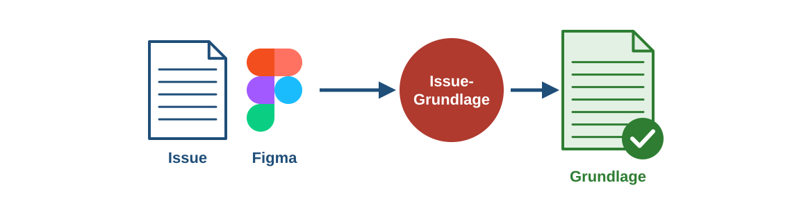

Bodo Teichmann · Stand 27.09.2026

<!--
Vom GitLab-Issue + Figma zu einer rückfragefreien Planungsgrundlage für den Coding Agent.
-->

---

<!-- _class: lead -->

# Teil 1 · Meine Hypothesen

<!--
Meine Grund-Hypothesen (Post-Überschrift)
- Die folgenden zwei Folien sind meine persönlichen Hypothesen.
- Ich will sie niemandem aufzwingen – sie sollen zum Nachdenken und Diskutieren anregen.
- Danach folgt der praktische Teil mit Empfehlungen für unsere Arbeit.
-->

---

<!-- _header: Persönliche Hypothese -->

## Agents liefern alles – innerhalb von Leitplanken

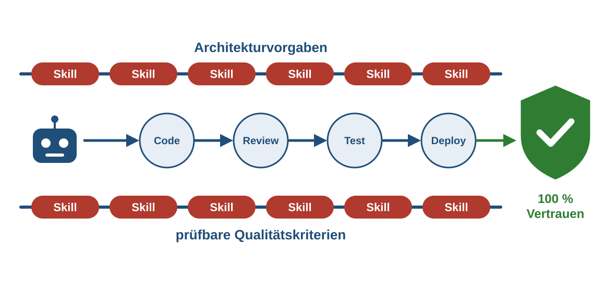

<!--
• Coding Agents sind inzwischen "schlau" genug, um die komplette Produktion des Codes inkl. Code-Review, Deployment etc. zu übernehmen
• das geht aber nicht "einfach so"
• Der Schlüssel sind Orchestrierung und Guard Rails in Form von z. B. Architekturvorgaben und prüfbaren Qualitätskriterien, die so engmaschig und zuverlässig sind, dass die Entwickler 100 % Vertrauen darin haben.
* solange dieses 100 % Vertrauen fehlt, müssen halt noch Code Reviews gemacht werden und die Skills und Guardrails verbessert werden
-->

---

<!-- _header: Persönliche Hypothese -->

## Das Berufsbild löst sich auf

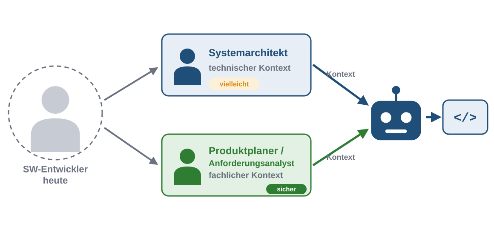

<!--
• provokante Hypothese: letztlich löst sich das Berufsbild des SW-Entwicklers auf.
    – was bleibt, ist vielleicht der Systemarchitekt, der technischen Kontext und technische Anforderungen zusammenstellt
    – und mit Sicherheit der Produktplaner/Anforderungsanalyst/Anwenderversteher, der den fachlichen Kontext zusammenstellt.
-->

---

<!-- _class: lead -->

# Teil 2 · Empfehlungen

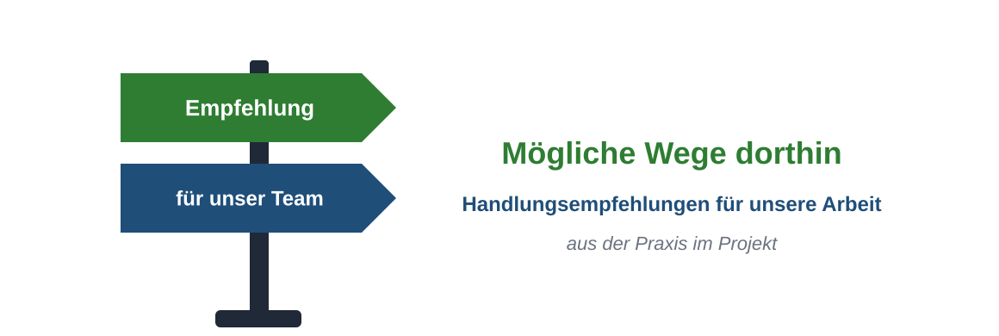

<!--
Mögliche Wege dorthin (Post-Überschrift)
- Ab hier: mögliche Wege dorthin – als Handlungsempfehlung für uns Entwickler gedacht.
- Basierend auf den Erfahrungen mit Skills im Projekt, konkret am Beispiel des Skills issue-grundlage.
-->

---

## Volle Verantwortung für erzeugten Code

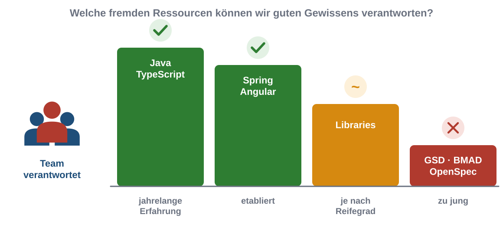

<!--
• Entwicklerteams sollen volle Verantwortung für erzeugten Code übernehmen. Welche fremden Ressourcen können sie guten Gewissens verantworten?
    – etablierte Programmiersprachen (z. B. Java, TypeScript) sind ok, jahrelange gute Erfahrung
    – etablierte Frameworks (Spring, Angular) ebenso
    – sonstige zusätzliche Libraries sind, je nach Reifegrad und Community-Support, teilweise auch ok
    – fremde Skillsets (GSD, BMAD, OpenSpec etc.) gibt es noch nicht lange genug, um ähnliches Vertrauen zu rechtfertigen. Ihr Reifegrad muss als unzureichend bewertet werden.
    – "Fertige Skillsets" wie z. B. GSD, BMAD oder OpenSpec sind beeindruckend und funktionieren für mich bei kleineren Projekten, bei denen nicht viel auf dem Spiel steht. Aber für große Projekte habe ich (noch) kein hundertprozentiges Vertrauen.
-->

---

## Skills selbst entwickeln

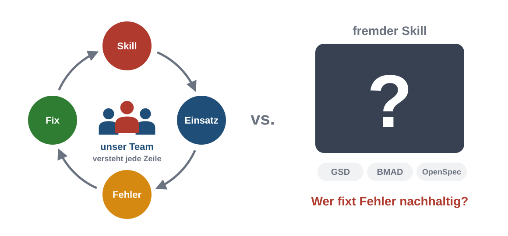

<!--
• Diese Architekturvorgaben und prüfbaren Qualitätskriterien sind als Skills realisiert, die aber NICHT von anderen übernommen, sondern vom selben Entwicklerteam selbst entwickelt und immer weiter verfeinert werden.
• in "fremde" Skills kann vielleicht noch ein einzelner Entwickler 100 % Vertrauen haben, aber was, wenn sich doch Fehler einschleichen? Wer fixt diese nachhaltig, sodass sie auch in Zukunft nicht mehr auftreten?
• Daher: Skills müssen (jedenfalls derzeit noch) für größere, längerfristige Projekte von den Teams selbst entwickelt werden.
• Skills werden inkrementell verbessert
• Das Team sollte genau verstehen, was in den Skills drinsteht.
-->

---

## Fremde Skills sind gefährlich

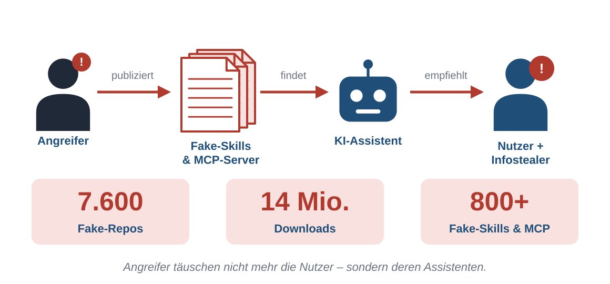

<!--
• Skills aus anderen Quellen sind potentiell extrem gefährlich (https://www.artificialintelligence-news.com/news/ai-agents-are-becoming-a-new-malware-distribution-channel/):
    – Roughly 7,600 fake GitHub repositories, 6,600 fraudulent profiles and more than 14 million downloads: that is the scale of FakeGit, a malware campaign documented by Island in July 2026. Over 800 repositories impersonated AI skills and MCP servers, distributing SmartLoader and the StealC infostealer.
    – Fake repositories are nothing new. The surprise was who recommended them.
    – Gemini and ChatGPT independently suggested the same malicious walmart-mcp repository. The agents found the attacker’s project and handed users installation instructions.
    – Attackers no longer need to deceive users directly. They can deceive the assistants users trust.
-->

---

## Skills im Projekt

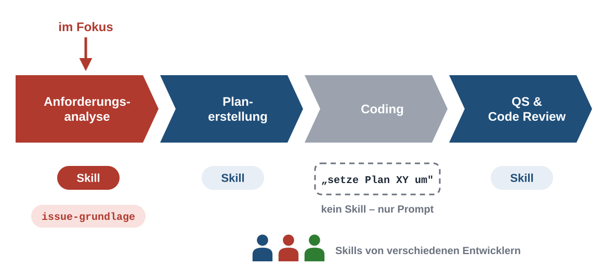

<!--
Skills im Projekt
• wir haben viele Skills im Projekt, von unterschiedlichen Entwicklern, für die verschiedenen Entwicklungsstadien eines Features/Work Items/Issues.
    – Anforderungsanalyse
    – Planerstellung
    – NICHT fürs eigentliche Coding: da reicht der Prompt: "setze Plan XY um"
    – Qualitätssicherung und Code Review
Im Folgenden besprechen wir nur den ...:
Skill zur Anforderungsanalyse
der Skill heißt bei uns "issue-grundlage"
-->

---

## Ziel: keine Korrekturschleifen

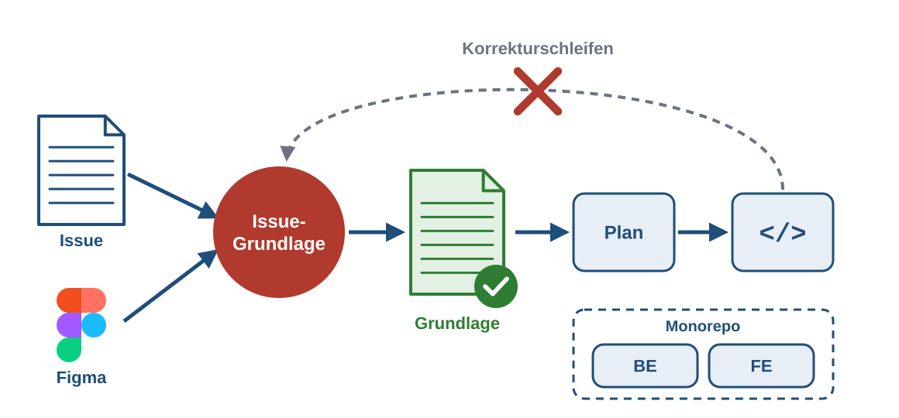

<!--
Korrekturschleifen vermeiden durch bessere Anforderungsanalyse
Um Korrekturschleifen zu vermeiden, haben wir den "Issue-Grundlage"-Skill iterativ entwickelt, der eine möglichst vollständige, umfassende und widerspruchsfreie Grundlage für die Planung eines Features (Work Item/Issue) liefern soll, sodass Planerstellung und Umsetzung ohne weitere Rückfragen vom Coding Agent durchgeführt werden können.
Voraussetzung: Monorepo für BE UND FE, eine Trennung von beiden macht m. E. für Coding Agents keinen Sinn
-->

---

## Ausgangssituation

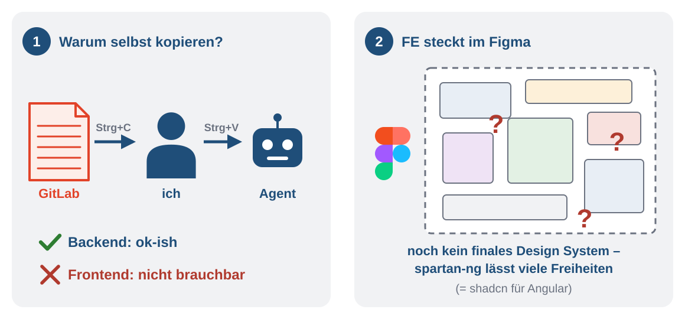

<!--
Ausgangssituation:
Ich kopiere den Issue-Text aus GitLab in den Prompt. Funktioniert für reine Backend-Tasks ok-ish, aber nicht für Frontend.
Das Problem
1. Warum selber kopieren? Kann doch der Coding Agent auch!
2. Problem: Anforderungen für FE liegen größtenteils im Figma. Aber: Wir haben (noch) kein fertiges Design System, sondern nur die Entscheidung, "spartan-ng" zu verwenden. "Spartan-ng" ist ein "shadcn"-Komponentenset für Angular.
Einschub: Shadcn:
shadcn/ui is a set of beautifully-designed, accessible components and a code distribution platform. Works with your favorite frameworks and AI models. Open Source. Open Code.
This is not a component library. It is how you build your component library.
-->

---

## Vier Iterationen

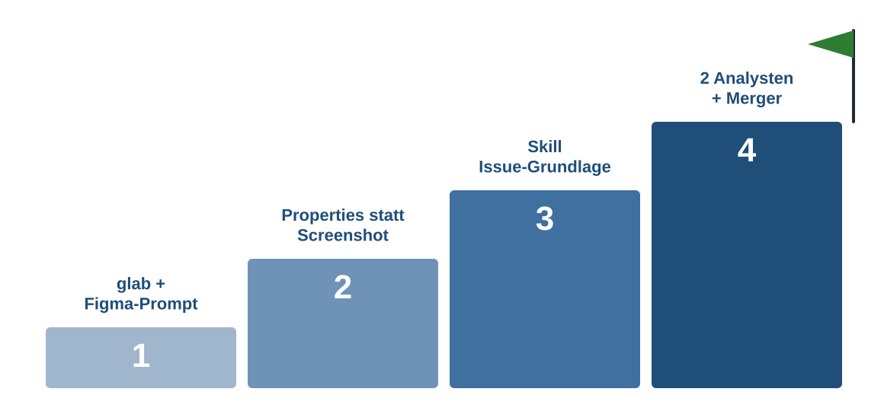

<!--
Lösung
-->

---

## Iteration 1: GitLab-Skill + Figma-Prompt

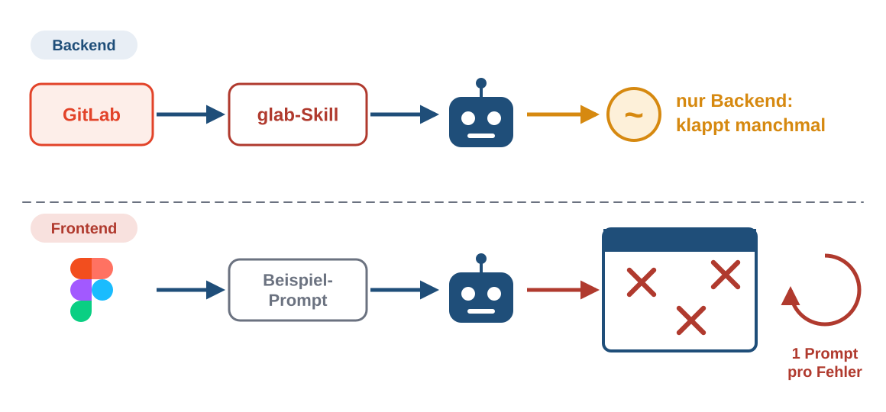

<!--
Iteration 1
• Skill für GitLab, basierend auf der glab-CLI
• Figma Dev Mode + Figma-MCP-Server + Figma-Funktion "Beispiel-Prompt kopieren": den Prompt mit Link in meinen Prompt kopieren
Jedoch:
• Skill für GitLab läuft
• Aber: Der Figma-Beispielprompt bringt noch nicht die Details für FE wie gewünscht: FE hat viele Fehler, die alle nachgebessert werden müssen – zwar nicht manuell, aber mit je einem Prompt pro Problem, was viel Arbeit macht
-->

---

## Iteration 2: Properties statt Screenshot

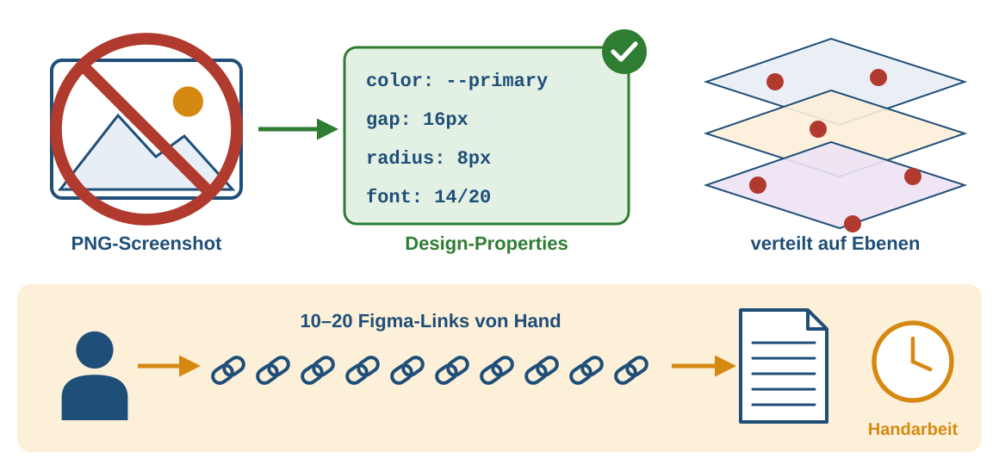

<!--
Iteration 2
• Figma-Skill, der den Agenten anweist, auf KEINEN FALL ein Design aufgrund eines Figma-PNG-Screenshots zu machen, sondern ihn zwingt, die Figma-Design-Properties zu lesen und diese zu verwenden
• Figma-Design-Properties sind im Figma jedoch verteilt:
        – verschiedene Aspekte des Designs stehen auf verschiedenen "Ebenen"
        – in verschiedenen "Objekten",
        – zukünftige, aber für das aktuelle Issue noch nicht relevante Details sind auch schon drin und müssen (noch) ignoriert werden
        – der Coding Agent schafft es nicht, sich aus einem einzigen Figma-Link die relevanten Punkte rauszupicken
• daher: alle relevanten Figma-Links (typischerweise 10–20) manuell zusammensuchen und ins Issue reinkopieren, genau an die Stellen im Issue, wo die zugehörigen Akzeptanzkriterien stehen.
Jedoch
• viel manuelle Recherche in Figma: Der Entwickler muss die passenden Stellen suchen, die Links erzeugen und manuell ins Issue kopieren -> viel Arbeit
• Ergebnis besser, aber nicht überzeugend: Der Coding Agent übersieht nach wie vor viele wichtige Design-Details
-->

---

## Iteration 3: Skill „Issue-Grundlage"

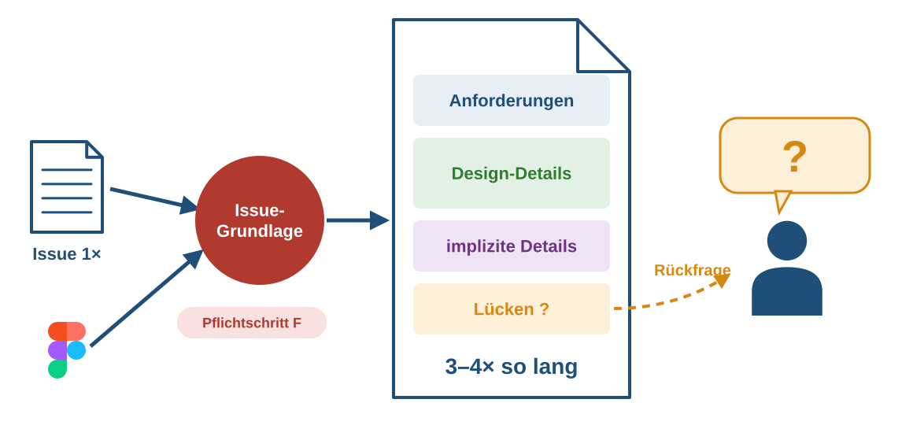

<!--
Iteration 3
• neuer Skill "Issue-Grundlage"
• Figma-Entwürfe so anlegen, dass der Coding Agent sich selbstständig zurechtfindet
Konzept "Issue-Grundlage":
• Issue-Inhalt zunächst ins Projekt unter tmp/issue<nr>.md kopieren lassen.
• präzise Anweisungen, wie der Agent den Figma-MCP und die Links zum Figma nutzen muss:
        – siehe "Pflichtschritt F — Figma-Komponenten-Varianten" im "issue-grundlage"-Skill des Projekts
• tmp/issue<nr>.md stark erweitern lassen um alle interessanten und auch impliziten Details, insb. bezüglich Design, aber auch alle fachlichen Definitionslücken rigoros aufdecken und per User-Rückfrage schließen.
• Ergebnis ist ein neues MD-File, das 3- bis 4-mal so lang ist wie das ursprüngliche Issue in GitLab
Jedoch
• Funktioniert schon besser, aber immer noch Lücken und Missverständnisse
-->

---

## Iteration 4: Zwei Analysten, ein Merger

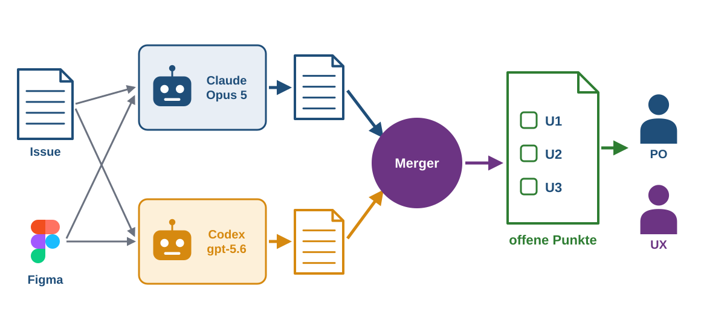

<!--
Iteration 4
• mehrere Agenten (Claude und Codex) mit demselben Skill auf dasselbe Issue und dieselben Figma-Links ansetzen.
• 2 konkurrierende Ergebnisse produzieren
• finaler Vergleich, Deduplizierung, Aufdecken von Widersprüchen durch einen Coding Agent (hier: Claude, wegen des größeren Tokenbudgets)
• Ergebnis: eine Liste "offener Punkte", die der Entwickler mit PO und UX-Designerin klären muss.
-->

---

## Nicht verhandelbare Regeln

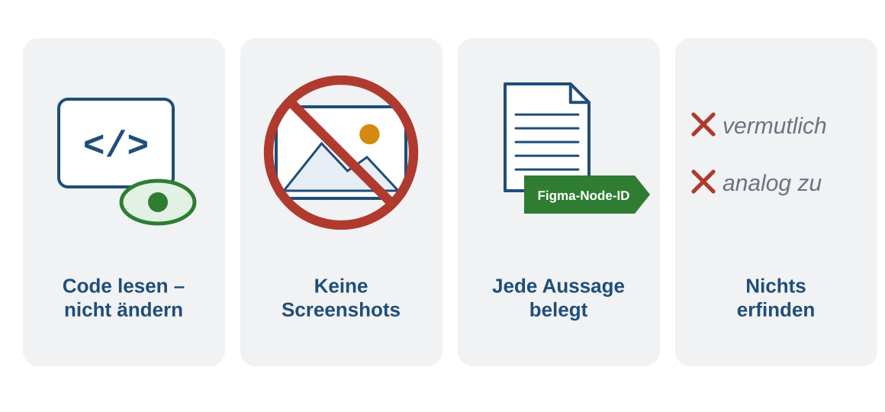

<!--
- Kein Plan – aber der Bestand zählt: Quellcode lesen ist erlaubt und bei Erweiterungen bestehender Features Pflicht (A6b). Nur lesend: kein Edit, kein Build, keine Tests.
- Bestand ist Befund, nicht Anforderung: weicht er von Issue oder Figma ab, ist das ein Widerspruch oder offener Punkt.
- Screenshots sind keine Designquelle – verbindlich ist nur Figma-MCP.
- Jede Aussage ist mit Issue-Stelle oder Figma-Node-ID belegt.
- Nichts erfinden: kein „vermutlich", kein „analog zu" – Unklares kommt in die Klärungsliste.
- „Lücke im Figma" erst nach durchgeführtem Komponenten-Lookup.
-->

---

## Pflichtschritt F – der Kern

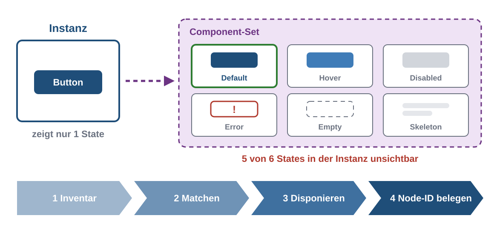

<!--
- get_metadata / get_design_context auf einer Instanz zeigen nur den aktuell eingestellten Variant-State.
- Emptystate, Skeleton, Hover, Disabled, Error existieren nur am Component-Set → jede Instanz ist verdächtig.
- 1. Komponenten-Inventar pro Datei erheben. 2. Jede Instanz dagegen matchen.
- 3. Alle Variant-Properties disponieren (Pflicht-Tabelle). 4. Relevante Varianten auflösen, Node-ID ins Ergebnis.
-->

---

## Figma-Zugang: ein lokaler Server

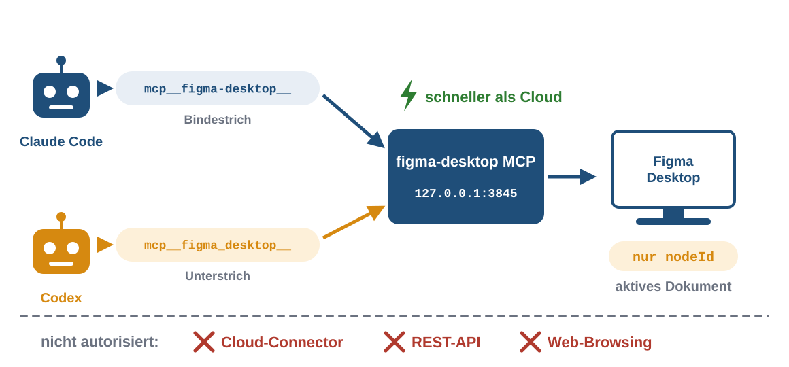

<!--
- Beide Harnesses nutzen denselben lokalen Dev-Mode-Server von Figma Desktop (http://127.0.0.1:3845/mcp) – schneller als die Cloud-Variante.
- Nur der Namespace unterscheidet sich: Claude Code mcp__figma-desktop__ (Bindestrich), Codex mcp__figma_desktop__ (Unterstrich).
- Der Server arbeitet mit dem aktiven Dokument in Figma Desktop: Tools bekommen nodeId, kein fileKey.
- Komponenten-Inventar in beiden Harnesses per get_metadata auf der „Components"-Page.
- Der gehostete Connector ist nicht autorisiert, auch nicht als Fallback; kein Ausweichen auf REST-API oder Web-Browsing.
- Vorab-Check mit curl auf den Server; hängt er, Figma Desktop komplett beenden (⌘Q) und neu starten.
-->

---

## Analysekatalog A1–A9

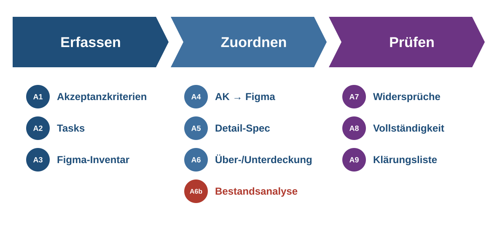

<!--
- Beide Analysten arbeiten genau diesen Katalog ab – nur so sind die Ergebnisse vergleichbar.
- AK-IDs sind stabil (AK2.1, AKK1 für Kommentare, T<iid>.1 für Tasks) und im Wortlaut übernommen.
- A5: so ausformuliert, dass ein Entwickler ohne Rückfrage umsetzen kann.
- Neu: A6b Bestandsanalyse – was ist neu, was trägt der Bestand schon, was muss geändert werden.
- A9: Klärungsliste U1…Un mit Frage, Bezug, warum blockierend, Optionen, Empfehlung.
-->

---

## Zuordnung AK → Figma

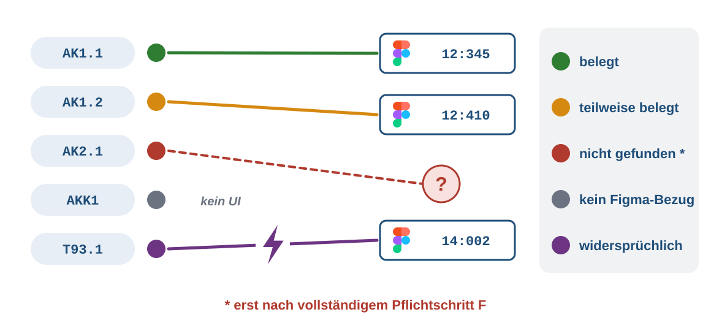

<!--
- Jede AK-Zeile bekommt genau eine Zeile in der Zuordnungstabelle, mit Figma-Node-ID und Status.
- „im Figma nicht gefunden" ist nur nach vollständigem Pflichtschritt F zulässig.
- Widersprüche Issue/Figma werden mit Belegen auf beiden Seiten geführt.
-->

---

## Bestandsanalyse (A6b)

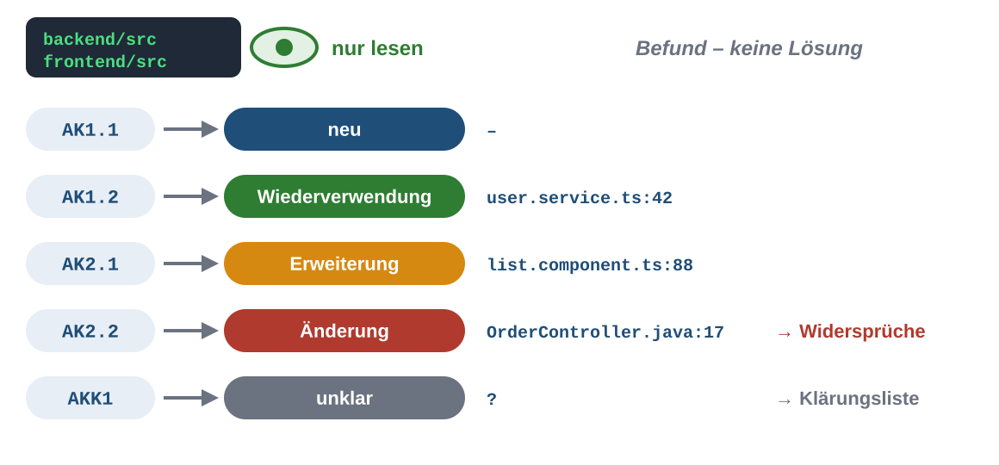

<!--
- Pflicht, sobald das Work Item ein bestehendes Backend-Feature oder eine bestehende UI erweitert.
- Einstiegspunkte per Grep/Glob suchen (Endpunkte, Domain-Begriffe, Komponenten, Routen) und die Stellen tatsächlich lesen.
- Je AK eine Einstufung: neu, Wiederverwendung, Erweiterung, Änderung (→ zusätzlich Widersprüche) oder unklar (→ zusätzlich Klärungsliste).
- Jede Zeile mit Pfad und Zeilennummer belegt – ohne Beleg ist es eine Vermutung.
- Keine Lösung entwerfen: kein Klassenschnitt, keine Arbeitspakete – nur der Befund.
- Neubau auf der grünen Wiese: ein Satz mit Begründung und den Suchbegriffen, die nichts ergeben haben.
-->

---

## Ablauf

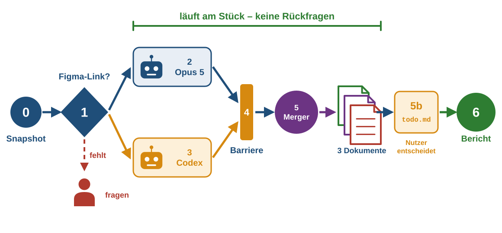

<!--
- Phase 0: Work Item, Tasks (GraphQL-Hierarchie) und alle Kommentare → Snapshot.
- Phase 1: Figma-Link aus dem Snapshot; fehlt er → nachfragen. Vorab-Check des lokalen Figma-Servers.
- Phase 2/3: Opus 5 und Codex (jetzt Effort Medium) parallel, gleicher Snapshot, gleicher Katalog.
- Phase 4: Barriere – beide Dateien vollständig, inkl. Varianten-Tabelle 4.2 und Bestandsanalyse 6b.
- Phase 5: Merger → drei Dokumente (Hauptdokument, Widersprüche, Klärung).
- Phase 5b: TODO-Abgleich – alle todo.md gegen das Work Item; passende TODOs legt der Orchestrator dem Nutzer einzeln vor, nie still übernehmen oder verwerfen.
- Phase 6: Kurzbericht, Klärungsliste und TODO-Entscheidungen an den Nutzer.
-->

---

## Zusammenführung

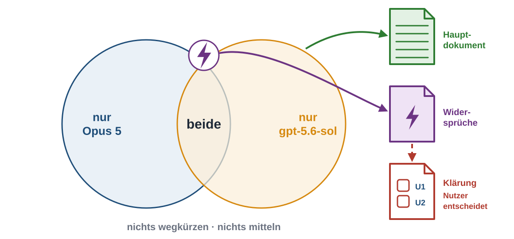

<!--
- Gemeinsames wird ein Eintrag [beide]; Einseitiges bleibt mit [nur Opus 5] / [nur gpt-5.6-sol].
- Widersprüche zwischen den Analysen werden zusätzlich Klärungspunkte – der Nutzer entscheidet, der Merger mittelt nicht.
- Neu: drei verlinkte Dokumente – Hauptdokument, Widersprüche (Abschnitt 9) und Klärungsliste (Abschnitt 10).
- Grund: die Klärungsliste wird abgearbeitet und abgehakt, die Widerspruchsliste entschieden – anders benutzt als das Hauptdokument.
- Ergebnis im Status ENTWURF – erst nach Klärung Grundlage für den Plan.
-->

---

## Lessons Learned

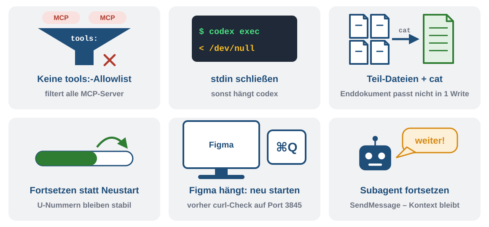

<!--
- tools:-Allowlist in der Agent-Definition filtert alle MCP-Server heraus → Subagent hat kein Figma.
- codex exec immer mit < /dev/null, sonst wartet es unbegrenzt auf stdin; Ausgabe in Logdatei statt | tail.
- Enddokument 60–200 KB passt nicht in einen Write → Merger schreibt Teil-Dateien, Orchestrator hängt sie per cat zusammen.
- Bei Abbruch fortsetzen, nicht neu starten – sonst stimmt die U-Nummerierung nicht mehr.
- Lokaler Figma-Server bleibt gelegentlich hängen: curl-Check auf Port 3845, Figma Desktop mit ⌘Q beenden und neu starten.
- Danach denselben Subagenten per SendMessage fortsetzen – er behält seinen Kontext; nicht auf den Rückfallweg ausweichen.
-->

---

<!-- _class: lead -->

# Fazit

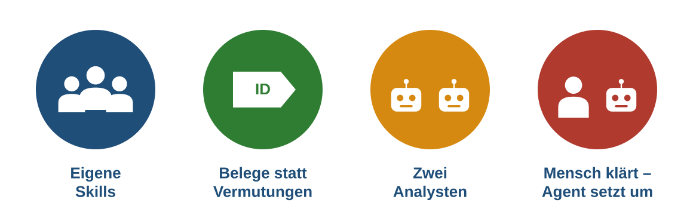

**Fragen?**
